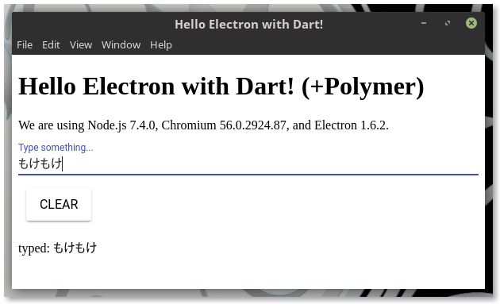

Hello Electron with Dart! (+Polymer)
====================================

レンダラ側をDartで書いたElectronのサンプルコードです。<br>
Polymer.dartのpaper-elementも使用しています。

## Description

スタンドアローンなデスクトップアプリをWeb技術とDart言語で書きたいと思った場合、
今まではChromeアプリを作成する方法があったのですが、
ChromeOS以外では2018年中に起動すら不可(の予定)となりました。<br>
このサンプルコードはElectronへの乗り換えのノウハウを書きとどめて置くためのものです。<br>

なお、元はDartコードでもElectronで動く際にはJSにトランスパイル済みである必要がありますが、
開発中（ビルドやパッケージ作成する前）でも pub serveが使える様に仕込みを入れています。<br>
その辺りも参考になればと思います。

## Demo

[本家Electronのチュートリアル](https://electron.atom.io/docs/tutorial/quick-start/)
をベースに、以下の様な簡単なアプリを作成します。

* Polymerのpaper-inputを使用した入力欄にテキストを打つと、一番下の「typed:」に
  入力内容が連動して表示されます。
* CLEARボタンをクリックすると、入力内容が消去されます。
* ついでに、Node.js等のバージョンが表示されます（本家チュートリアル同様）。

 

## Requirement

Dartのコンパイル環境とnode.js(6系)は予めインストール済みとします。<br>
なお、本サンプルコードはLinuxで実行を確認していますが、他のOSについては適宜読み替え願います。

## Installation

ローカルにcloneします。

```bash
$ git clone https://github.com/takutaro/electron-with-dart-sample.git
又は
$ git clone git@github.com:takutaro/electron-with-dart-sample.git
みたいな
```

依存パッケージを取得します。

```bash
$ cd electron-with-dart-sample
$ pub get

$ cd web
$ npm install
```

## Usage

まず、cloneしたディレクトリ（pubspec.yamlのある場所。上記ではelectron-with-dart-sample）で、
pub serve起動します。

```bash
$ cd electron-with-dart-sample
$ pub serve
Loading source assets...
Loading polymer transformers...
Serving electron_with_dart web on http://localhost:8080
Build completed successfully
```

次に別ターミナルで、Electronアプリを「pubserve」指定で起動します。

```bash
$ cd electron-with-dart-sample
$ cd web
$ npm run-script pubserve

> electron-with-dart@1.0.0 pubserve /home/taku/workspace/electron-with-dart-sample/web
> electron . --pubserve
```

pubserve指定はDartでの開発用にオリジナルのチュートリアルからアレンジした部分です。<br>
main.jsからローディングするindex.htmlを、ファイルから直接ではなく
pub serveが提供するhttpサーバから取得する様にしました。

pub serveからローディングするindex.htmlや関連するDartコードはElectronで動作できる様に
JSへトランスパイル（＆トランスフォーム）済みのものです。<br>
pub serveはコード修正(ファイルセーブ)に追随してほぼリアルタイムにトランスパイルしてくれるので、
ElectronアプリはCtrl+Rでのリロードのみで動作確認が出来ます。<br>
（自動リロードされるともっと良いのですが）

## Anything Else

pub buildでJSにトランスパイルしてしまえば後は通常のElectronアプリなので、
パッケージ化が可能です。

```bash
$ cd electron-with-dart-sample
$ pub build
$ cd build/web
$ electron-packager .

$ cd electron-with-dart-linux-x64
$ ./electron-with-dart
```

## Author

takutaro

## License

特に無いです。
